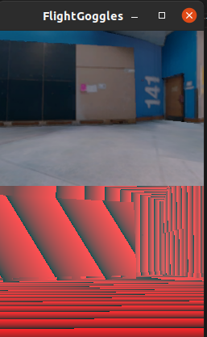

## Frequently Asked Questions

### I'm having issues with python/linux packages, how can I fix this?

Using a conda environment to run the challenge can solve many package issues. Otherwise, check that your system is using the correct version and furthermore, check the requirements.txt file and see if the problem is there. If all else fails, try force reinstalling the specific package version using pip.

### Something happened and FlightGoggles never closed. What should I do?

Our Python software operates by launching FlightGoggles in a subprocess.
Nominally, Python will track this subprocess and shutdown FlightGoggles prior to shutting itself down.
However, in some situations FlightGoggles may remain open after closing Python (e.g., an error in Python).

In these situations, you can safely close FlightGoggles by clicking on the `x` on the window.
Alternatively you can shut it down using linux tools such as `kill` or `pkill`, which may be necessary if you are operating on a server or remote machine.

### I'm getting an error about a port (or address) already being in use. What should I do?

If you observe this error, the most likely cause is that you have a python or FlightGoggles already running that is connected to that port.
This may have happened due to an error or some issue when previously running Python with FlightGoggles.
In this case, you will have to identify the process ID (`pid`) of your previous Python (`ps aux | grep python`) or FlightGoggles (`ps aux | grep FlightGoggles`) instance.
Then, use `kill` to stop the process.

Alternatively, it may be possible you are trying to use a port reserved by another system.
In this case, select a new port to use.

### The depth camera in FlightGoggles looks weird. Is it broken?

Short answer: probably not! 

Below is an example screen shot showing an RGB camera image on top and a depth image below.
Note the stripped effect on the depth image, which is perfectly normal.
Unity is embedding depth information into the three RGB channels, so you see the result of that embedding.

### Can I run FlightGoggles headless?

Yes! See the FlightGoggles documentation [here](https://flightgoggles-documentation.scrollhelp.site/fg/headless-ubuntu-server-e-g-aws).
It is possible the run headless with some additional setup.
This may be desirable if you want to develop and/or train on a remote server.

### I trained my agent but I didn't get any model output?

By default checkpoints are saved every 100 steps in the ray_results folder. You can change how often it saves by editing the associated training .yaml config file.

### My agent just spins infinitely/moves super slowly/gets stuck in one area, how do I unstuck it?

You may have overtrained your agent. Try using a checkpoint output from a training run with less steps.

### How can I test my agent on the same environment, instead of a random one every time?

Use the --seed flag in the evaluation command, more details are in evaluate-agent.py

### How can I see the details of the gym environment the challenge uses?

The gym environment is found in the rl_navigation package.

### I'm getting an error about a size mismatch of the model I'm evaluating, how can I fix this?

Make sure the size and shape parameters in your evaluation .yaml config matches the parameters of the model you trained.

